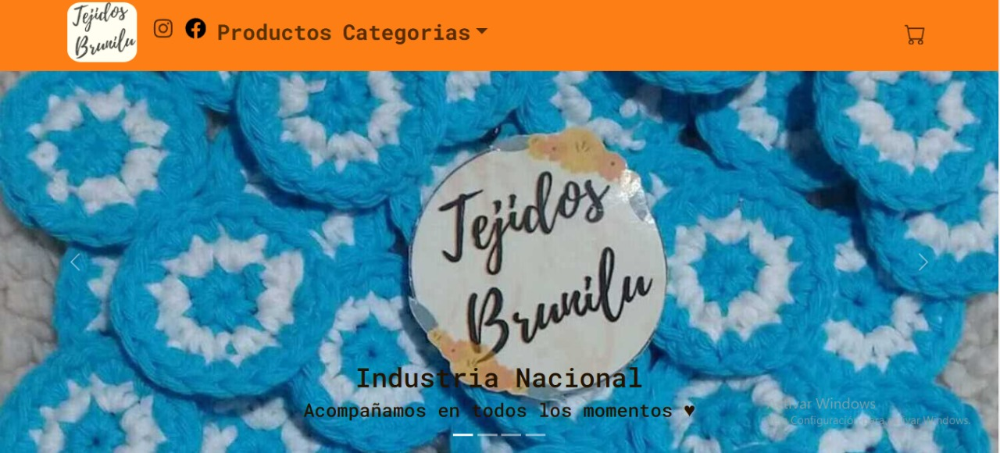

# Tejidos Brunilu Shop 🛒🧶

Proyecto E-commerce desarrollado con React - JavaScript.
Tienda virtual de elementos tejidos.

### Instalación ⚙️

1. Clone el repositorio
2. Ejecute npm install para instalar dependencias y crear la carpeta node_modules
3. Ejecute npm run dev para levantalo en servidor local

### Librerias utilizadas 📖

- [Bootstrap](https://getbootstrap.com/docs/5.2/getting-started/introduction/): utilizada para el styling de la app.
- [React Bootstrapp](https://react-bootstrap.netlify.app/):utilizada para el styling de la app.
- [Firebase](https://firebase.google.com/): utilizado como base de datos.
- [React Router Dom](https://reactrouter.com/): navegación por rutas.
- [SweetAlert](https://sweetalert2.github.io/): utilizado para alertas y confirmaciones.
- [React Spinners](https://www.davidhu.io/react-spinners/):utilizada para el Loader.

## Demostración

